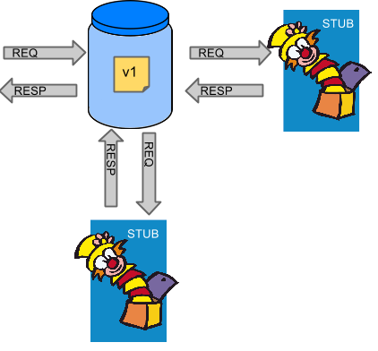
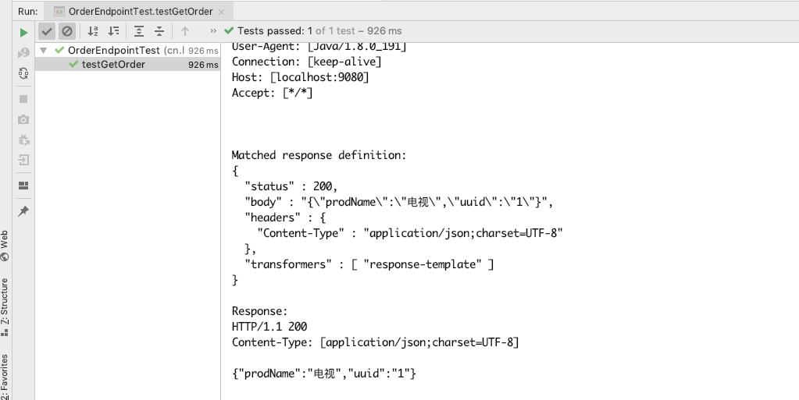

# Table of Contents

* [Spring-Cloud-Contract 演示项目](#spring-cloud-contract-演示项目)
  * [一. 简述](#一-简述)
  * [二. 搭建一个环境](#二-搭建一个环境)
    * [2.1 订单服务](#21-订单服务)
    * [2.2 产品服务](#22-产品服务)
    * [2.3 请求订单接口](#23-请求订单接口)
  * [三. 生产者提供`contract`包](#三-生产者提供`contract`包)
    * [3.1 引入相关包](#31-引入相关包)
    * [3.1 编写 `Contract`](#31-编写-`contract`)
    * [3.2 生成桩](#32-生成桩)
  * [四. 消费者使用`contract`包](#四-消费者使用`contract`包)
    * [4.1 引入相关包](#41-引入相关包)
    * [4.2 编写测试类](#42-编写测试类)
    * [4.3 配置服务名称](#43-配置服务名称)
    * [4.4 运行测试](#44-运行测试)
  * [参考资料](#参考资料)


# Spring-Cloud-Contract 演示项目

🤡用于演示如何使用 `Spring-Cloud-Contract` 进行离线测试

## 一. 简述

在项目开发的时候，特别是使用 `TDD` 进行开发的项目，测试便是不可或缺的一个环节。然而我们的服务一般都需要配合其他服务接口来进行开发，那么测试的时候就需要开启所有服务来配合测试，机器配置跟不上，在构建的时候也会出现很多问题。

这时候就需要有一个东西来把调用第三方接口的事情给做了。最近看了`Clossoverjie`的一篇文章 [分享几个 SpringBoot 实用的小技巧](https://crossoverjie.top/2018/10/15/SpringBoot/SpringBoot-tips/#more)，他很巧妙的利用 `Spring` 的容器把连接第三方接口的 `bean` 给替换掉。但我感觉始终还不是那么优雅（嗯，`Spring` 脑残粉，`Spring` 提供了就会用）。

现在 `Spring-Cloud` 提供了一个插件，`Spring-Cloud-Contract` 可以巧妙的对消费者项目进行打桩，让项目的测试调用访问的时候，可以模拟第三方业务，这也需要生产者提供一个 `Contract` 来使用。（当然，挺适合我这种一个人开发多个服务的开发者）



## 二. 搭建一个环境

OK，演示需要有个大概的业务示例来做。

我这里模拟了订单服务需要从产品服务获取产品的描述（不要吐槽，随便想到罢了）。那么调用订单服务就需要调用到产品服务了，我将演示如何在订单服务中将产品服务给 `Mock` 掉。

项目情况：

- Eureka: 注册中心
- product-server：产品服务
- order-server：订单服务
- SpringCloud：`Edgware.SR3`
- SpringBoot：`1.5.10.RELEASE`

### 2.1 订单服务

获取一个订单的时候，需要获取产品信息的接口

```java
@RestController
public class OrderEndpoint {

    private ProductClient productClient;

    @Autowired
    public OrderEndpoint(ProductClient productClient) {
        this.productClient = productClient;
    }

    @GetMapping
    public Order get(@RequestParam("productUuid") String productUuid) {
        // 这里需要调用产品服务接口来获取产品信息
        ProductDesciption productDesciption = productClient.uuidOf(productUuid);
        return new Order(UUID.randomUUID().toString(), productDesciption);
    }

}

// 产品客户端
@FeignClient(name = "product-server")
public interface ProductClient {

    @RequestMapping(method = RequestMethod.GET)
    ProductDesciption uuidOf(@RequestParam("uuid") String uuid);

}

// 订单DTO类
public class Order {

    private String uuid;

    private ProductDesciption productDesciption;

    // 省略getter&setter
}

// 产品类，用于接收上游接口返回的信息
public class ProductDesciption {

    private String prodName;

    // 省略getter&setter
    
}
```

### 2.2 产品服务

产品服务随意的提供了产品信息。

```java
@RestController
public class ProductEndpoint {

    @GetMapping
    public Product uuidOf(@RequestParam("uuid") String uuid) {
        switch (uuid) {
            case "1":
                return new Product("1", "电视");
            case "2":
                return new Product("2", "iPhone");
        }
        return new Product();
    }

}
public class Product {

    private String uuid;

    private String prodName;
	
    // 省略getter&setter
}
```

### 2.3 请求订单接口

我用了 `idea` 自带的 `HTTP` 工具来测试接口，返回正常

```
GET http://127.0.0.1:8082?productUuid=1

HTTP/1.1 200 
X-Application-Context: order-server:8082
Content-Type: application/json;charset=UTF-8
Transfer-Encoding: chunked
Date: Tue, 11 Dec 2018 02:41:59 GMT

{
  "uuid": "53ddfe48-0bf9-43d9-abb5-65a59468a5b5",
  "productDesciption": {
    "prodName": "电视"
  }
}
```

## 三. 生产者提供`contract`包

### 3.1 引入相关包

```xml
<!--契约测试服务提供端依赖-->
<dependency>
    <groupId>org.springframework.cloud</groupId>
    <artifactId>spring-cloud-starter-contract-verifier</artifactId>
    <scope>test</scope>
</dependency>
<!--以下需要放在 plugins 标签中-->
<plugin>
    <groupId>org.springframework.cloud</groupId>
    <artifactId>spring-cloud-contract-maven-plugin</artifactId>
    <!-- Don't forget about this value !! -->
    <extensions>true</extensions>
    <configuration>
        <!-- MvcMockTest为生成本地测试案例的基类 -->
        <baseClassForTests>com.springboot.services.producer.MvcMockTest</baseClassForTests>
    </configuration>
</plugin>
```


### 3.1 编写 `Contract` 

可以使用 `groovy` 或者 `yaml` 进行编写，我就提供 `groovy` 版本了。

需要放在 `src/test/resources/contracts/ProductEndpoint.groovy` 中，注意资源包下的那个目录。

```groovy
package contracts

import org.springframework.cloud.contract.spec.Contract

Contract.make {
    request {
        // 请求方法
        method 'GET'
        // 路径
        url('/') {
            queryParameters {
                parameter("uuid", "1")
            }
        }
    }
    response { // 响应设置
        status 200
        body("""
          {
              "uuid": "1",
              "prodName": "电视"
            }
  """)
        headers {
            header('Content-Type': 'application/json;charset=UTF-8')
        }
    }
}

```

### 3.2 生成桩

生成 `Mapping.json`，放在`product-server/target/stubs/META-INF/cn.liweidan.contract/product-server/1.0.0-SNAPSHOT/mappings/ProductEndpoint.json` 中，里面是对请求响应的设定

```shell
cd product-server # pom.xml 所在目录
mvn spring-cloud-contract:convert # 转换成mapping.json
mvn spring-cloud-contract:generateStubs # 生成 jar 包
mvn install:install-file -DgroupId=cn.liweidan.contract \
	-DartifactId=product-server -Dversion=1.0.0-SNAPSHOT \
	-Dpackaging=jar -Dclassifier=stubs -Dfile=target/product-server-1.0.0-SNAPSHOT-stubs.jar # 安装到本地仓库
```

OK，已经将 `product-server` 的桩打进 `maven` 仓库了，现在可以在消费者那边进行使用


## 四. 消费者使用`contract`包

### 4.1 引入相关包

```xml
<!-- SpringBoot 测试 -->
<dependency>
    <groupId>org.springframework.boot</groupId>
    <artifactId>spring-boot-starter-test</artifactId>
    <scope>test</scope>
</dependency>
<!--契约测试服务提供端依赖-->
<dependency>
    <groupId>org.springframework.cloud</groupId>
    <artifactId>spring-cloud-starter-contract-stub-runner</artifactId>
    <scope>test</scope>
</dependency>
```

### 4.2 编写测试类

这里跟参考资料作者写的就有点区别了，可能是因为升级了版本 `@AutoConfigureStubRunner` 的 `stubsMode` 属性已经取消了。

这里是去 `maven` 仓库查找。

`ids` 属性指定的是刚刚打包的桩的坐标

格式是：`groupId:artifactId:version:classifier:port`

```java
package cn.liweidan.contract.order.endpoint;

import org.hamcrest.core.Is;
import org.junit.Test;
import org.junit.runner.RunWith;
import org.springframework.beans.factory.annotation.Autowired;
import org.springframework.boot.test.autoconfigure.web.servlet.AutoConfigureMockMvc;
import org.springframework.boot.test.context.SpringBootTest;
import org.springframework.cloud.contract.stubrunner.spring.AutoConfigureStubRunner;
import org.springframework.test.context.junit4.SpringRunner;
import org.springframework.test.web.servlet.MockMvc;
import org.springframework.test.web.servlet.request.MockMvcRequestBuilders;
import org.springframework.test.web.servlet.result.MockMvcResultMatchers;

/**
 * Description：测试订单端口
 *
 * @author liweidan
 * @version 1.0
 * @date 2018-12-11 12:02
 * @email toweidan@126.com
 */
@RunWith(SpringRunner.class)
@SpringBootTest
@AutoConfigureMockMvc
// ids 指定需要打桩的服务，记住写 workOffline
@AutoConfigureStubRunner(ids = {"cn.liweidan.contract:product-server:1.0.0-SNAPSHOT:stubs:9080"}, workOffline = true)
public class OrderEndpointTest {

    @Autowired
    private MockMvc mvc;

    @Test
    public void testGetOrder() throws Exception {
        mvc.perform(MockMvcRequestBuilders.get("/").param("productUuid", "1"))
                .andExpect(MockMvcResultMatchers.status().isOk())
                .andExpect(MockMvcResultMatchers.jsonPath("productDesciption.prodName", Is.is("电视")));
    }

}

```

### 4.3 配置服务名称

我已经顺便把测试的时候把 `eureka` 的链接关闭了。

完整配置（`test/resources`）：

```yaml
eureka:
  client:
    enabled: false
server:
  port: 8082
spring:
  application:
    name: order-server
stubrunner:
  idsToServiceIds: # 用于指定 feign 名字对应的 stubs 包。前面是 feign 名字，后面是 stubs 包的 artifactId
    product-server: product-server
```

### 4.4 运行测试



OK，单机测试可以用过了。

当然测试还包括数据库使用内存数据库等等，可以防止在 `maven` 编译的时候报错，这块其他文章再说


## 参考资料

[[基于Feign的微服务调用之契约测试 Spring Cloud Contract](https://segmentfault.com/a/1190000015555626)](https://segmentfault.com/a/1190000015555626?utm_source=tag-newest#articleHeader0)

[Contract-dsl](https://cloud.spring.io/spring-cloud-contract/single/spring-cloud-contract.html#contract-dsl)

[SpringCloudContractDocs](https://cloud.spring.io/spring-cloud-static/Edgware.SR3/single/spring-cloud.html)

